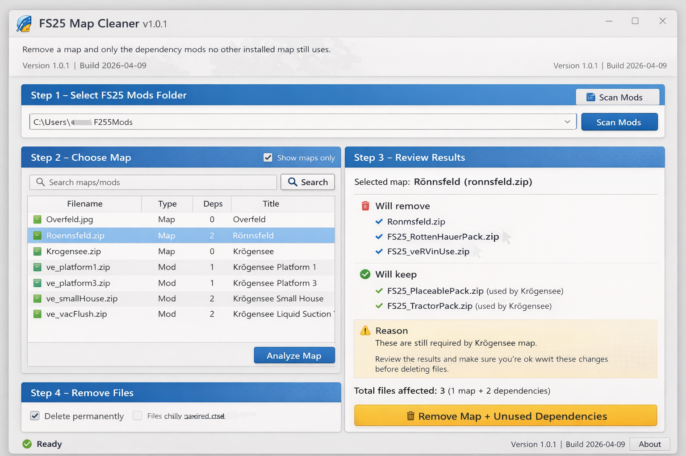

# FS25 Map Cleaner

## Download

[**Download FS25MapCleaner.exe**](https://github.com/ctig2015/FS25MapCleaner/releases/latest/download/FS25MapCleaner.exe)

FS25 Map Cleaner is a Windows tool for **Farming Simulator 25** that helps you remove a map and only the dependency mods that are no longer used by:

- another installed map or mod
- a savegame you choose to protect

## Why this app exists

A lot of FS25 maps need extra packs, placeables, vehicle packs, or other dependency mods just to work.

That becomes a pain when you want to remove one map, because:

- one map can need **10, 20, or more** extra mods
- some of those same dependency mods may still be used by another map
- some of them may also still be used in another savegame through vehicles, buildings, or placeables

FS25 Map Cleaner is designed to make that job easier and safer.

## What the app does

When you pick a map, the app can:

1. scan your FS25 `mods` folder
2. read dependency information from each mod's `modDesc.xml`
3. build the selected map's dependency tree
4. check whether other installed maps or mods still use those dependencies
5. optionally scan selected savegames for XML references such as `vehicles.xml` and `placeables.xml`
6. remove only the selected map plus the dependency mods that are no longer needed anywhere else

## Main idea

The goal is simple:

**Remove the map you do not want anymore without removing shared mods that another map, mod, or savegame still needs.**

---

# Interface guide

The app is laid out as a simple step-by-step tool.

## Step 1 – Select FS25 Mods Folder and Optional Savegame Protection

This section is where you tell the app where your mod files are and which savegames you want to protect.

### Mods folder box
Shows the path to your FS25 `mods` folder.

### Browse…
Lets you choose the FS25 `mods` folder on your PC.

Use this if your mods are not in the default location or if they are on another drive.

### Scan Mods
Scans the selected mods folder.

What it does:
- reads installed ZIP and folder mods
- loads dependency information
- identifies probable maps
- fills the list in Step 2

Use this every time you change the mods folder or add/remove mods.

### Protected savegames list
Shows the savegame folders you have added for protection scanning.

If a dependency mod appears to be used in one of these savegames, the app will keep it instead of removing it.

### Add Savegame…
Lets you add a savegame folder to protect.

Use this when:
- you want to remove one map
- but another save may still use vehicles, buildings, placeables, or other content from one of that map's dependency mods

### Remove Selected
Removes the highlighted savegame from the protection list.

It does **not** delete the savegame itself. It only removes it from the app's protection scan list.

### Clear
Clears the whole savegame protection list.

This does **not** delete any savegames. It only turns off savegame protection until you add folders again.

---

## Step 2 – Choose Map

This section is where you choose what you want to remove.

### Search maps/mods
Filters the list to help you find a map or mod faster.

### Show maps only
Shows only probable maps in the list.

This is useful when your mods folder contains a lot of non-map mods and you only want to pick from maps.

### Map list columns

- **Filename** = the ZIP or folder name
- **Type** = whether the item looks like a map or a normal mod
- **Deps** = how many direct dependencies were found
- **Title** = the detected display title if available

### Analyze Map
Analyzes the selected item.

What it does:
- builds the dependency tree for the selected map/mod
- checks whether dependencies are shared by other installed mods/maps
- checks selected savegames for XML references
- prepares a keep/remove summary in Step 3

Use this before deleting anything.

---

## Step 3 – Review Results

This section is the safety check.

It tells you exactly what the app plans to remove and what it plans to keep.

### Selected map
Shows the item currently being analyzed.

### Will remove
These are the files the app believes are safe to remove.

That usually includes:
- the selected map
- dependency mods that are not used by anything else

### Will keep
These are dependency mods that the app detected are still needed.

Reasons include:
- another installed map or mod still depends on them
- a selected savegame still appears to reference them

### Reason box
Explains **why** something is being kept.

This is important because it helps you understand whether a dependency is shared or savegame-protected.

### Total files affected
Shows how many files the app plans to remove.

Use this as a final quick check before pressing the delete button.

---

## Step 4 – Remove Files

This section controls how the actual removal works.

### Delete permanently
When ticked, files are deleted directly instead of being moved to quarantine.

Use permanent delete only if you are sure.

If you want a safer workflow, leave permanent delete off so you can review removed files later.

### Remove Map + Unused Dependencies
This is the main action button.

It removes:
- the selected map
- dependency mods that are no longer needed by another installed map/mod
- dependency mods that are not protected by the selected savegame scan

It does **not** remove:
- shared dependencies still used somewhere else
- dependencies still referenced by protected savegames

### About
Shows the app version and build number.

Useful when reporting bugs or checking which build you are using.

---

## Bottom status area

The bottom of the app shows current status information.

Examples:
- ready
- scanning mods
- scan complete
- analysis complete

The bottom-right corner also shows the current app version and build.

---

# Recommended way to use it

1. Close **Farming Simulator 25**
2. Open **FS25MapCleaner.exe**
3. Click **Browse…** and select your FS25 `mods` folder
4. Add any savegames you want protected using **Add Savegame…**
5. Click **Scan Mods**
6. Tick **Show maps only** if you only want to see maps
7. Select the map you want to remove
8. Click **Analyze Map**
9. Read the **Will remove** and **Will keep** sections carefully
10. Decide whether to use **Delete permanently**
11. Click **Remove Map + Unused Dependencies**

---

# Savegame protection explained

This is one of the most useful features in the app.

Example:

- Map A needed a vehicle pack and a placeable pack
- you now want to remove Map A
- but Savegame B still uses a shed, trailer, or other item from one of those packs

Without savegame protection, you might accidentally remove a mod that another save still needs.

With savegame protection turned on, the app scans selected savegames for XML references and keeps dependency mods that still look in use.

## Files the app may check in savegames

Examples include:
- `vehicles.xml`
- `placeables.xml`
- other XML files inside the selected savegame folder

This is a **best-effort safety feature**, not a perfect guarantee, but it is much safer than removing everything blindly.

---

# What the app keeps automatically

A dependency is kept when the app detects that it is still needed by:

- another installed map
- another installed mod
- a protected savegame you selected

---

# What the app removes

A dependency is removed only when the app believes it is **not** still used by:

- another installed map
- another installed mod
- a selected protected savegame

---

# Important notes

- Close Farming Simulator 25 before using the app
- The app works best when mod authors have declared dependencies correctly in `modDesc.xml`
- Savegame protection is based on XML references the app can detect
- Windows may show a warning because the EXE is not code-signed
- Large mod folders can take a little time to scan

---

# Good reasons to use this app

This tool is especially useful if you:

- test a lot of maps
- swap maps often
- have a huge mods folder
- want to clean up old map dependencies safely
- have saves that still use content from dependency packs

---

# Feedback and support

If something does not look right, please report it.

- [Open an Issue](https://github.com/ctig2015/FS25MapCleaner/issues) for bugs, crashes, wrong delete results, or dependency mistakes
- [Join Discussions](https://github.com/ctig2015/FS25MapCleaner/discussions) for ideas, suggestions, and test feedback

Helpful feedback includes:
- the map name
- approximate number of mods in the folder
- whether savegame protection was on or off
- what the app said it would remove
- what happened after removal
- screenshots if possible

---

# Current version

**Version 1.1.0**  
**Build 2026-04-09**
