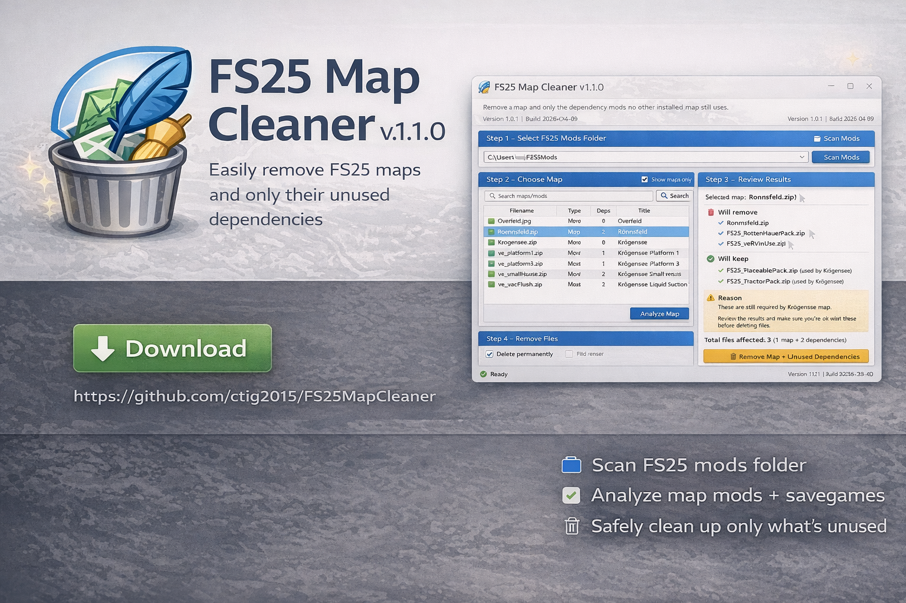

# FS25 Map Cleaner

  

## Download

[**Download FS25MapCleaner.exe**](https://github.com/ctig2015/FS25MapCleaner/releases/latest/download/FS25MapCleaner.exe)

FS25 Map Cleaner is a Windows tool for **Farming Simulator 25** that helps remove a map and only the dependency mods that are no longer used by:

- another installed map or mod
- a savegame you choose to protect

## What's fixed in v1.1.1

This patch restores the missing **Step 4 – Remove Files** section in the new interface.

You now get:

- the full **Remove Map + Unused Dependencies** button back
- a **Delete permanently** option
- a cleaner right-side layout where the remove controls stay visible
- the savegame protection feature from v1.1.0

## Why this app exists

A lot of FS25 maps need extra packs, placeables, vehicle packs, or other dependency mods just to work.

That becomes a pain when you want to remove one map, because:

- one map can need **10, 20, or more** extra mods
- some of those dependency mods may still be used by another map
- some may also still be used in another savegame through vehicles, buildings, or placeables

FS25 Map Cleaner is designed to make that job easier and safer.

## How the cleanup works

When you pick a map, the app can:

1. scan your FS25 `mods` folder
2. read dependency information from each mod's `modDesc.xml`
3. build the selected map's dependency tree
4. check whether other installed maps or mods still use those dependencies
5. optionally scan selected savegames for XML references such as `vehicles.xml` and `placeables.xml`
6. remove only the map and the dependency mods that are no longer used anywhere else

## Step-by-step

### Step 1 – Select FS25 Mods Folder and Optional Savegame Protection

This top section is where you tell the app what to scan.

**FS25 Mods Folder**
- Select your main `mods` folder for Farming Simulator 25.

**Browse...**
- Opens a folder picker for your FS25 `mods` folder.

**Scan Mods**
- Scans every ZIP/folder mod in the selected `mods` folder.
- Reads dependency data from `modDesc.xml`.
- Builds the list you see in Step 2.

**Optional savegame protection**
- You can add one or more savegame folders before analyzing a map.
- If a dependency mod is still referenced inside those savegames, the app will keep it.

**Add Savegame...**
- Adds a savegame folder to the protected list.

**Remove Selected**
- Removes the highlighted savegame from the protected list.

**Clear**
- Clears the protected savegame list.

### Step 2 – Choose Map

This is where you choose the map or mod you want to remove.

**Search box**
- Filters the list by filename or title.

**Show maps only**
- Hides non-map mods so it is easier to find maps.

**Mods list**
- Shows the filename, type, dependency count, and title.

**Analyze Map**
- Checks the selected map or mod.
- Builds the dependency tree.
- Compares it against other installed mods/maps.
- Checks selected savegames if you added any.
- Shows what will be removed and what will be kept.

### Step 3 – Review Results

This section explains what the cleanup would do before anything is deleted.

The review panel shows:
- the selected map
- what will be removed
- what will be kept
- why shared or savegame-used dependencies are protected

Use this section to confirm the result looks correct before clicking the remove button.

### Step 4 – Remove Files

This is the final action section.

**Delete permanently (skip quarantine)**
- Deletes files directly instead of moving them into the app's quarantine folder.
- Leave this unticked if you want the safer option.

**Remove Map + Unused Dependencies**
- Removes the selected map
- Removes only the dependency mods that are not used by:
  - another installed map or mod
  - any selected protected savegame

**About**
- Shows the current version and build.

## Safe use guide

1. Close Farming Simulator 25
2. Pick your `mods` folder
3. Add any savegames you want protected
4. Click **Scan Mods**
5. Pick the map you want to remove
6. Click **Analyze Map**
7. Read the review panel carefully
8. Click **Remove Map + Unused Dependencies** only if the result looks right

## Notes

- This tool depends on installed mod dependency metadata and detectable savegame XML references.
- If a mod author did not declare dependencies correctly, no tool can guarantee a perfect result.
- Large mod folders can take a few seconds to scan.
- Windows may show a warning because the EXE is not code-signed.

## Feedback

If you test the app, please report:
- map name
- approximate mod count
- whether the keep/remove result was correct
- whether savegame protection worked
- any crashes, freezes, or scan issues
